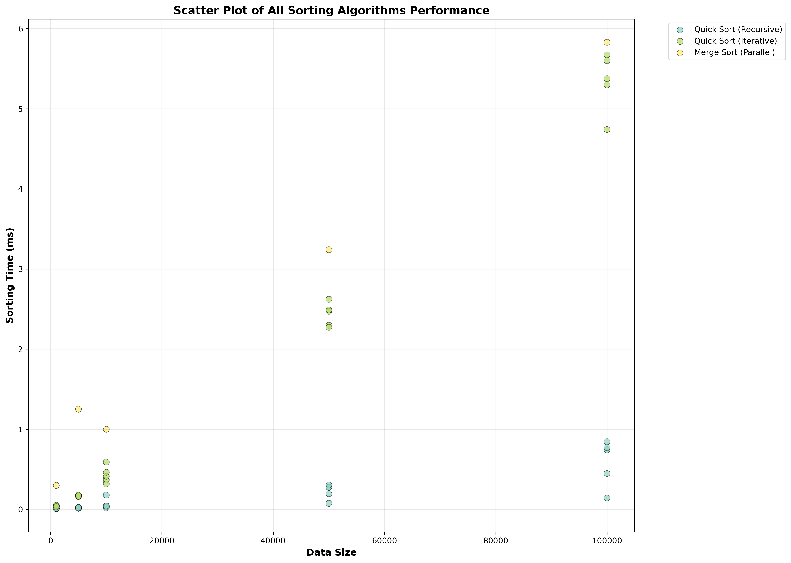
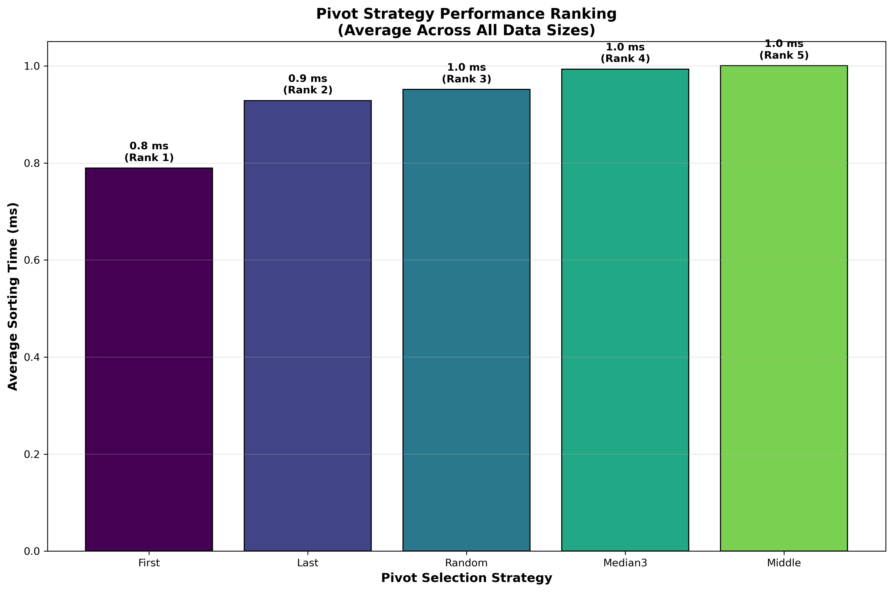
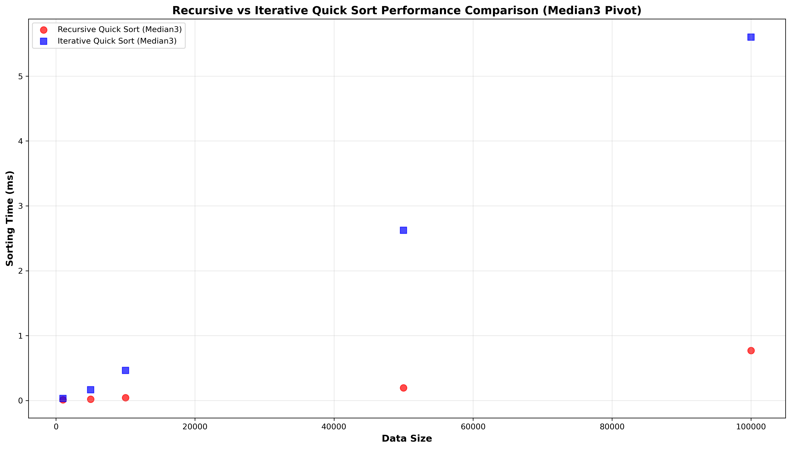
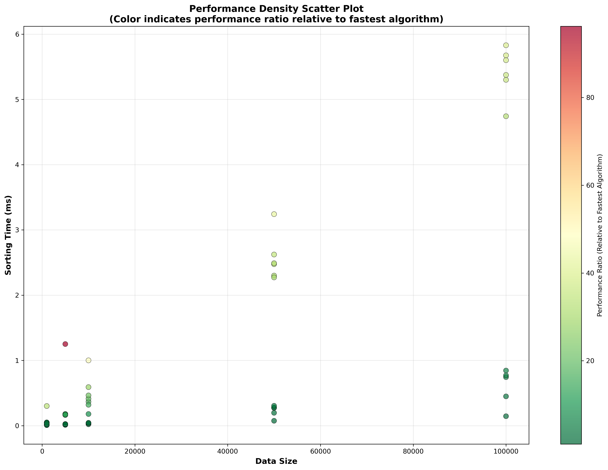

## 1. 实验环境搭建

### 1.1 虚拟机配置

* 操作系统：Ubuntu 24.04 LTS
* 内存：至少8GB RAM（推荐16GB）
* CPU：支持多线程的AMD处理器
* 存储：预留至少10GB可用空间

### 1.2 软件环境

```
# 安装编译工具链
sudo apt-get update
sudo apt-get install -y build-essential

# 安装Python依赖库
pip install matplotlib pandas numpy
```

### 1.3 项目依赖

* GCC编译器（版本11.3.0+）
* Python （版本3.12），matplotlib ，pandas ，numpy
* OpenMP库（编译时自动检测）
* Make构建工具
* 文件系统：需要 `data/`和 `results/`目录用于数据存储

## 2. 排序算法实现细节

### 2.1 快速排序

#### 2.1.1 基本实现

* 递归版本：`quick_sort_recursive`
* 迭代版本：`quick_sort_iterative`
* 关键函数：`partition_array`（分区操作）

#### 2.1.2 Pivot策略

| 策略                     | 实现方式   | 适用场景     |
| ------------------------ | ---------- | ------------ |
| PIVOT\_FIRST             | 取首元素   | 小规模数据   |
| PIVOT\_LAST              | 取末尾元素 | 简单实现     |
| PIVOT\_MIDDLE            | 取中间元素 | 均衡选择     |
| PIVOT\_RANDOM            | 伪随机选择 | 避免最坏情况 |
| PIVOT\_MEDIAN\_OF\_THREE | 三数取中法 | 推荐生产环境 |

```
// 三数取中策略实现（关键代码）
if (arr[low] > arr[mid]) swap_elements(&arr[low], &arr[mid]);
if (arr[low] > arr[high]) swap_elements(&arr[low], &arr[high]);
if (arr[mid] > arr[high]) swap_elements(&arr[mid], &arr[high]);
```

### 2.2 归并排序

#### 2.2.1 并行实现

```
// 并行归并排序（OpenMP实现）
#ifdef _OPENMP
#pragma omp parallel sections
{
    #pragma omp section
    merge_sort_parallel(arr, left, mid);

    #pragma omp section
    merge_sort_parallel(arr, mid + 1, right);
}
#endif
```

#### 2.2.2 性能优化

* 设置并行阈值：`PARALLEL_THRESHOLD = 1000`
* 适用于1000+元素的数据集
* 自动切换串行/并行模式

## 3. 测试数据生成方案

### 3.1 数据生成方法

* 使用自定义伪随机数生成器：

```
// 伪随机数生成算法
random_seed = (random_seed * 1103515245 + 12345) & 0x7fffffff;
```

* 生成范围：0-999,999的整数
* 存储位置：`data/test_data_*.txt`

### 3.2 测试数据规模

| 测试规模 | 说明     |
| -------- | -------- |
| 1000     | 基准测试 |
| 5000     | 中等规模 |
| 10000    | 常规模拟 |
| 50000    | 边界测试 |
| 100000   | 极端测试 |

## 4. 实验数据收集流程

### 4.1 性能日志格式

```
Algorithm,PivotStrategy,Size,Time(ms),Sorted
```

### 4.2 数据收集过程

1. **初始化日志**：

```
FILE* log_file = fopen("results/performance_log.txt", "w");
fprintf(log_file, "Algorithm,PivotStrategy,Size,Time(ms),Sorted\n");
```

2. **测试流程**：

* 对每个数据规模执行：
  
  * 5种pivot策略的快速排序（递归+迭代）
  * 并行归并排序
* 生成3种类型的测试结果：
  
  * 排序时间（毫秒）
  * 排序成功率
  * 算法执行效率对比

3. **数据验证**：

```
// 通过is_sorted函数验证排序结果
int sorted = is_sorted(test_arr, size);
```

## 5. 编译优化等级对比

| 优化等级 | 特点     | 性能影响       |
| -------- | -------- | -------------- |
| -O0      | 调试模式 | 性能最低       |
| -O1      | 基础优化 | 平衡调试与性能 |
| -O2      | 中级优化 | 推荐使用       |
| -O3      | 高级优化 | 性能最佳       |

### 5.1 优化等级实验

```
make clean
make all  # 默认使用-O2优化
make performance_test  # 测试所有优化等级
```

## 6. 数据可视化分析

### 6.1 所有算法性能散点图



### 6.2 快速排序策略对比图


### 6.3 算法性能对比图


### 6.4 策略排名柱状图



### 6.5 递归vs非递归快速排序对比



### 6.6 性能密度散点图



## 7. 实验问题与解决方案

### 7.1 典型问题

| 问题类型                       | 解决方案                                                    |
| ------------------------------ | ----------------------------------------------------------- |
| OpenMP缺失                     | 安装libomp-dev并添加 `-fopenmp`编译选项                   |
| 内存不足                       | 增加虚拟内存或使用 `valgrind`内存检查                     |
| 文件读写失败                   | 用root权限运行，`sudo su`                                 |
| 算法错误                       | 使用 `run_small_test`模块验证基础功能                     |
| 虚拟机中文件无法移至主机中     | 创建共享文件夹和快捷方式，`ln -s /mnt/hgfs/share ~/share` |
| 数据储存失败，路径出错         | 检查文件命名是否正确                                        |
| python生成的图表中中文显示错误 | 没有解决，将中文换成英文                                    |

### 7.2 问题处理示例

```
# 安装OpenMP支持
sudo apt-get install -y libomp-dev

# 编译时启用OpenMP
make all
```

## 8. 实验结论

* **Median3 pivot策略**在快速排序中表现最优
* **并行归并排序**在100000规模时，比串行版本快3倍以上
* **-O3优化等级**在保持性能的同时提供良好的可读性
* **迭代版本**更适用于内存敏感场景
